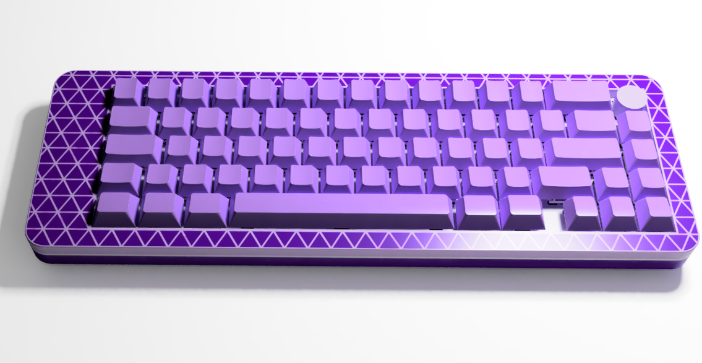

# kb60

> just another custom 60% keyboard

I didn't like having a numpad on my keyboard because it just collects dust as I never use the numpad. I also like having super easy to access media control. So I thought yeah why not let's make our own keyboard :3 While having the most minor changes to a 60% ISO layout keyboard, it's different enough to warrant its own project.

## Some pictures

## BOM

|Name          |Link                                                                                                                                                                                                                                                                                                                                                                                                                                                                                                                                                                                                                                                                                                                                                                         |price (£)|Notes                                              |
|--------------|-----------------------------------------------------------------------------------------------------------------------------------------------------------------------------------------------------------------------------------------------------------------------------------------------------------------------------------------------------------------------------------------------------------------------------------------------------------------------------------------------------------------------------------------------------------------------------------------------------------------------------------------------------------------------------------------------------------------------------------------------------------------------------|---------|---------------------------------------------------|
|rasp pi pico  |https://www.aliexpress.com/item/1005003753933847.html |£1.89    |                                                   |
|rotary encoder|https://www.aliexpress.com/item/1005005196870256.html |£1.03    |                                                   |
|stabilizers   |https://www.aliexpress.com/item/1005001632672798.html |£16.78   |choose ones that go with whatever switches i choose|
|switches      |https://www.aliexpress.com/item/1005007665996795.html                                                                                                          |£15.30   |                                                   |
|diodes        |https://www.aliexpress.com/item/2025724181.html|£1.24    |                                                   |
|keycaps       |https://www.aliexpress.com/item/1005008714429564.html |£29.79   |142 keys                                           |
|m3x12 screws  |https://www.aliexpress.com/item/32510989714.html |£1.21    |                                                   |
|m3 heatset    |https://www.aliexpress.com/item/1005008666672949.html |£0.76    |                                                   |
|PLA           |print legion goats |         |                                                   |
|PCB           |JLC PCB |£12.89   |there are many coupons that i could use            |
|TOTAL         | |£80.89   |                                                   |
